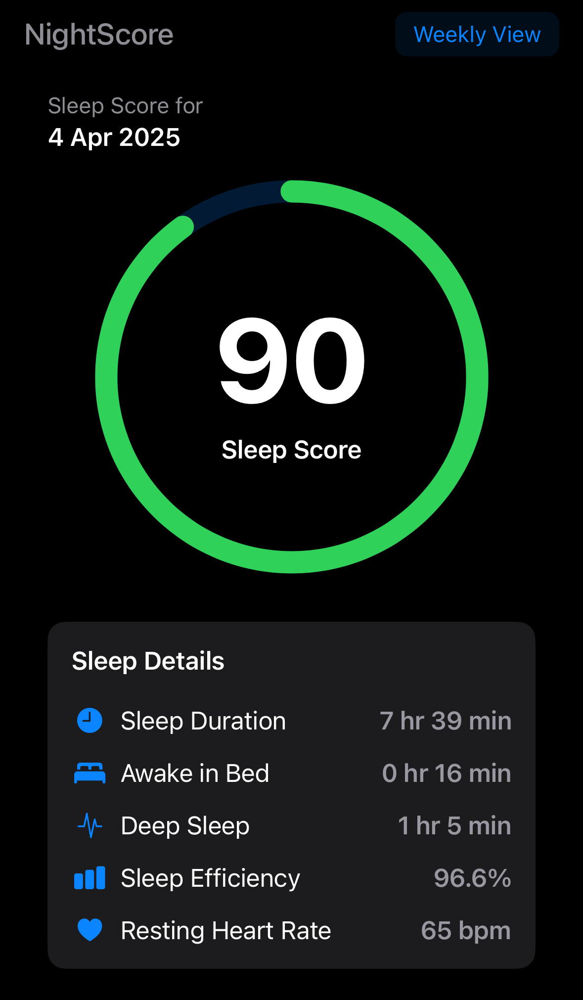
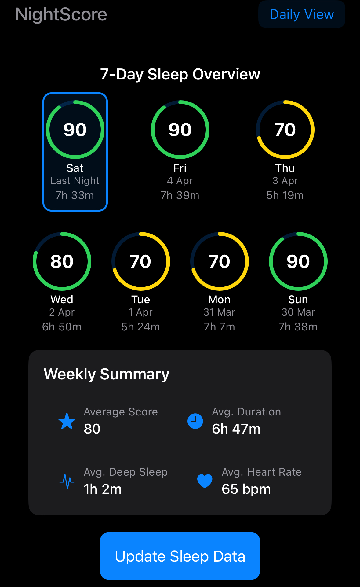

# NightScore

A sleep quality measurement app that analyzes HealthKit sleep data on iOS.

  
  

## Features

- Accesses HealthKit sleep data
- Calculates sleep score (0-100) based on:
  - Sleep duration (50% weight)
  - Deep sleep percentage (50% weight)
- Displays additional metrics:
  - Sleep efficiency
  - Deep sleep duration
  - Awake time in bed
  - Resting heart rate
- Shows 7-day historical view
- Widget for quick score reference

## Technical Implementation

- Swift/SwiftUI iOS app with WidgetKit extension
- HealthKit integration for sleep data access
- App Group for data sharing between app and widget
- Local data processing with no external API dependencies
- Separate timeline providers for widget refreshes

## Requirements

- iOS 15.0+
- Xcode 13.0+
- Device with HealthKit data

## Setup

1. Clone the repository
2. Update the App Group identifier in HealthKitManager.swift
3. Configure your development team in both targets
4. Build and run

## Architecture

- Main app with single-target structure
- Widget extension with separate entry point
- Shared data model between targets
- Background updates for widget refresh

## Privacy

- All processing occurs on-device
- No network access
- No analytics collection

## Known Issues

- Widget may display stale data if HealthKit authorization is revoked
- Deep sleep calculation depends on sleep stage data availability
- Score algorithm is basic and will be refined in future versions

## Testing Notes

Testing on simulator will not show real health data. Use a physical device with recorded sleep data for accurate testing.